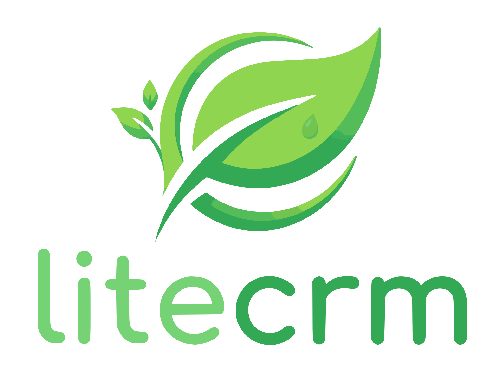

# LiteCRM


**LiteCRM** — это легковесная crm система 
для управления взаимоотношениями с продавцами и просмотра аналитики продаж

---

## Стек технологий

Зависимости необхомые для запуска и сборки приложения:
**[Docker](https://www.docker.com/)**, **Docker compose**

Для работы с функциями LiteCRM рекомендуется использовать программу [Postman](https://www.postman.com/)

* **Язык:** Java 21
* **Фреймворк** Spring Boot 4.0.6
* **База данных:** PostgreSQL 15, H2(используется в тестах)
* **Сборщик проекта:** Gradle 8.14
* **Инфраструктура:** Docker, Docker Compose

---
## Установка
Необходимо склонировать данный репозиторий в нужную вам директорию через команду

```bash
git clone https://github.com/QuietGerbi/shift-lite-crm.git
```
---
## Инструкции по сборке и запуску

Все команды выполняются из корневой папки shift-lite-crm:

### Запуск приложения c базой данных
```bash
docker compose up --build -d
```
### Запуск тестов
```bash
docker compose run crm-tests
```

---
## Для полного ознакомления

#### Руководство по использованию: [User guide](docs/usage.md)

#### Результаты тестирования программы [Tests result](docs/tests.md)