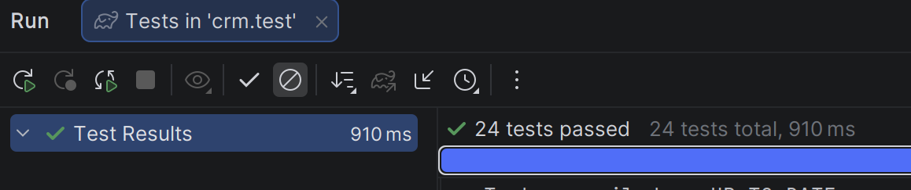
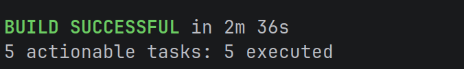
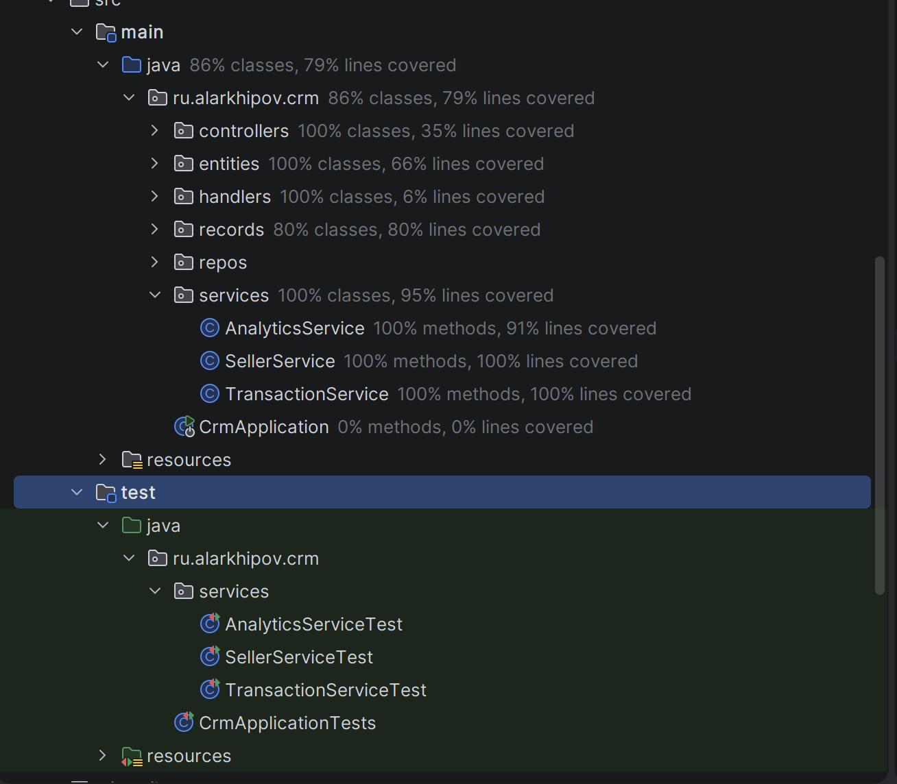

# Тестирование LiteCRM

Были написаны юнит-тесты с использованием **JUnit**.
Тесты покрывают методы классов из пакета services отвечающие за бизнес-логику

## Результаты тестов

Прогон тестов успешно завершается как локально, так и в изолированном Docker-контейнере `crm-tests`.

**Локально**

**Через контейнер**

## Покрытие кода

