# Руководство по использованию LiteCRM

## Как работать через Postman
* Убедитесь, что проект запущен в Docker (`docker compose up`).
* URL для всех запросов: `http://localhost:8080`
* Для `POST` и `PUT` запросов устанавливайте заголовок `Content-Type: application/json`.
* Выставите корректные параметры для отправки json запросов


---

## Методы LiteCRM, эндпоинты и примеры JSON

### Управление продавцами

* **`GET /sellers`** — Получить список всех продавцов.
* **`GET /sellers/{id}`** — Информация о конкретном продавце.
* **`POST /sellers`** — Создать нового продавца.
    * *Пример тела запроса:*
      ```json
      {
        "name": "Иван Иванов",
        "contactInfo": "+7 (999) 111-22-33",
        "registrationDate": "2026-05-19T12:00:00"
      }
      ```
* **`PUT /sellers/{id}`** — Обновить контактные данные продавца.
* **`DELETE /sellers/{id}`** — Удалить продавца.

### Учет транзакций

* **`GET /transactions`** — Список всех транзакций в системе.
* **`GET /transactions/{id}`** — Просмотр конкретного чека по id.
* **`GET /sellers/{id}/transactions`** — Посмотреть историю продаж конкретного сотрудника.
* **`POST /transactions`** — Создать новую транзакцию.
    * Пример тела запроса:
      ```json
      {
        "sellerId": 1,
        "amount": 15500,
        "paymentType": "CASH",
        "transactionDate": "2026-05-19T14:30:00"
      }
      ```

### Аналитика

* **`GET /analytics/most-productive/{option}`** — Найти лучшего продавца с максимальной суммой продаж за указанный период option=(day, month, quarter, year).
* **`GET /analytics/less-than?from=yyyy-mm-ddThh:mm:ss&to=yyyy-mm-ddThh:mm:ss&amount=AMOUNT_NUM`** — Список сотрудников, чья общая выручка ниже указанного лимита (параметр `amount`).
* **`GET /analytics/best-period/{Seller id}`** — Вычислить самое продуктивное время для конкретного сотрудника.

## Примеры использования

Ниже приведены примеры использования для каждого метода

**Sellers**

**`GET /sellers`**
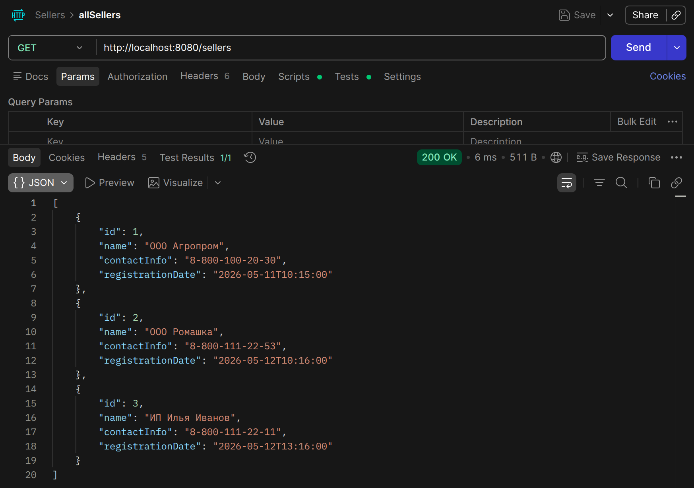

**`GET /sellers/{id}`**
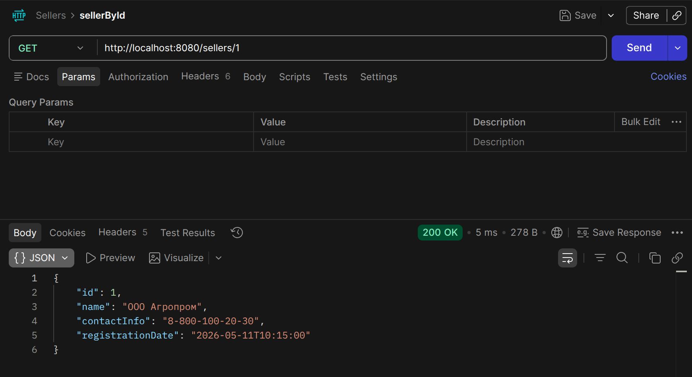

**`POST /sellers`**


**`PUT /sellers/{id}`**
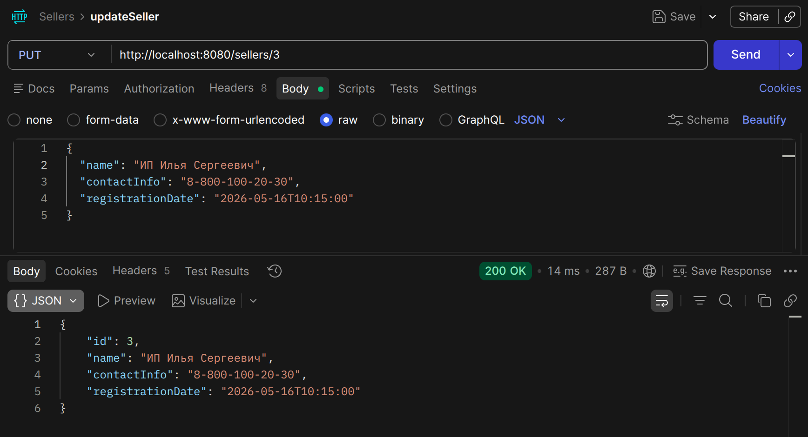

**`DELETE /sellers/{id}`**
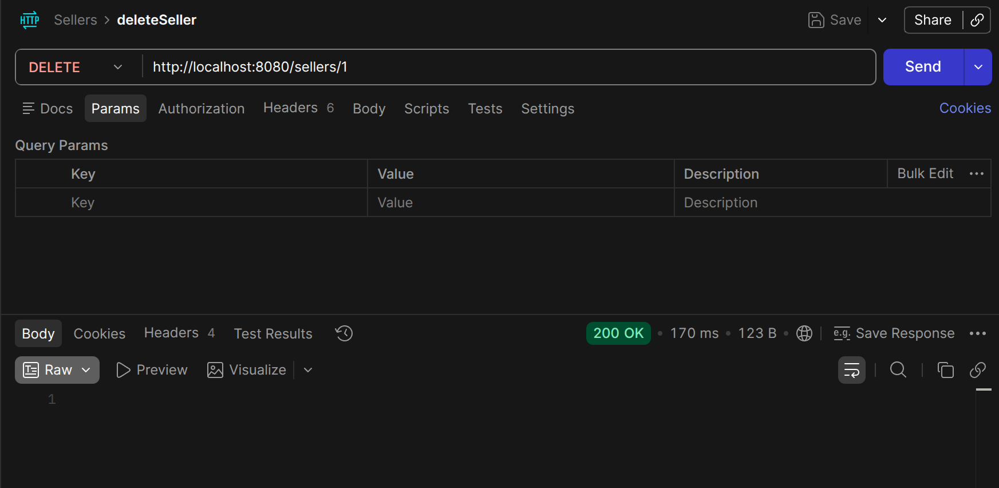
И вот результат:
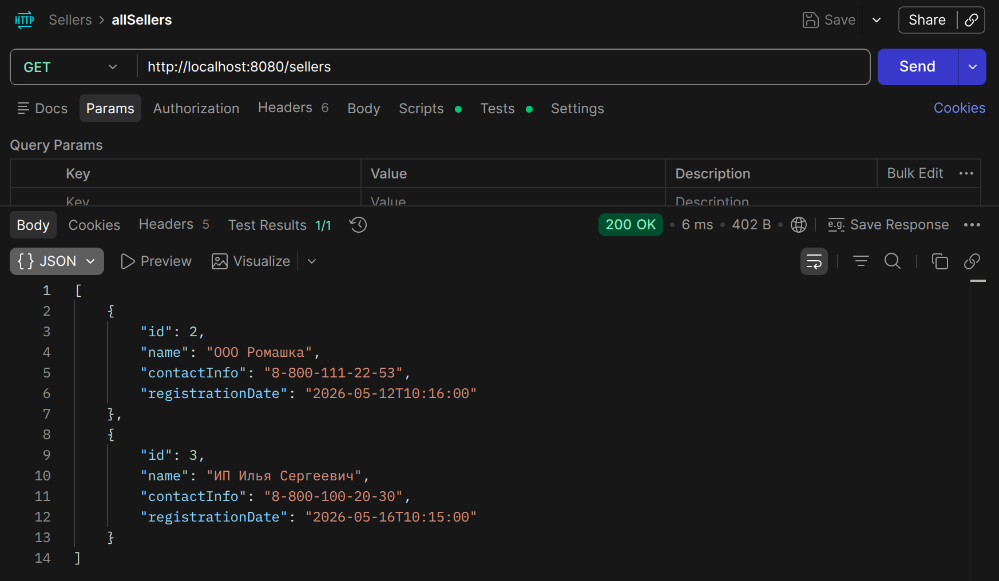

**Transactions**

**`GET /transactions`**
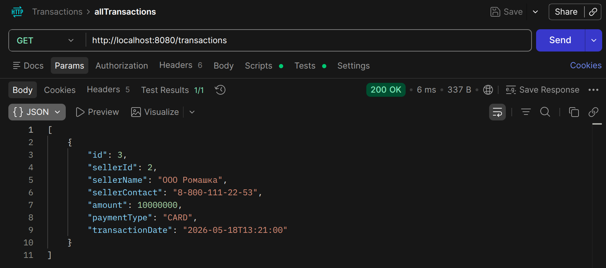

**`GET /transactions/{id}`**
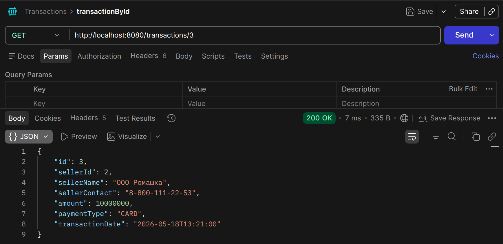

**`GET /sellers/{id}/transactions`**
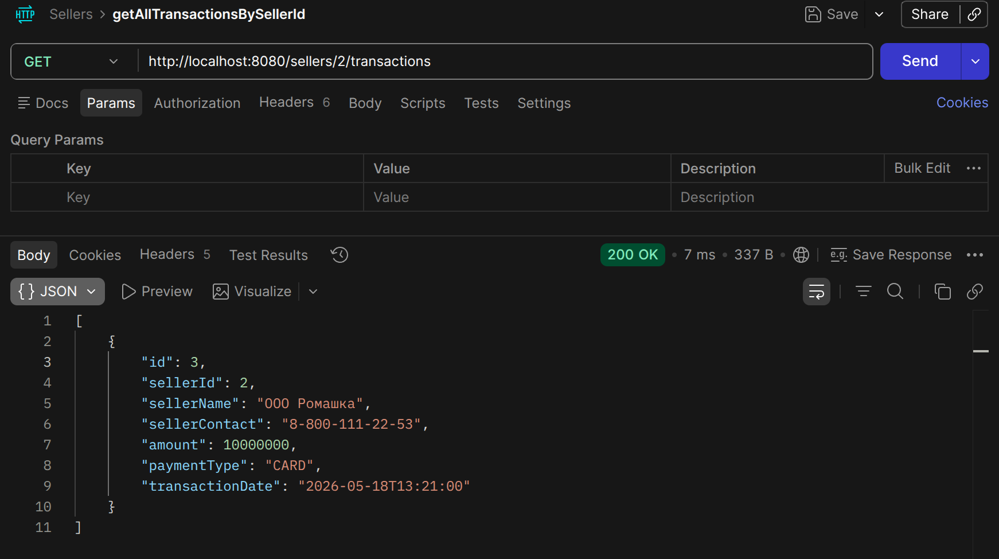

**`POST /transactions`**
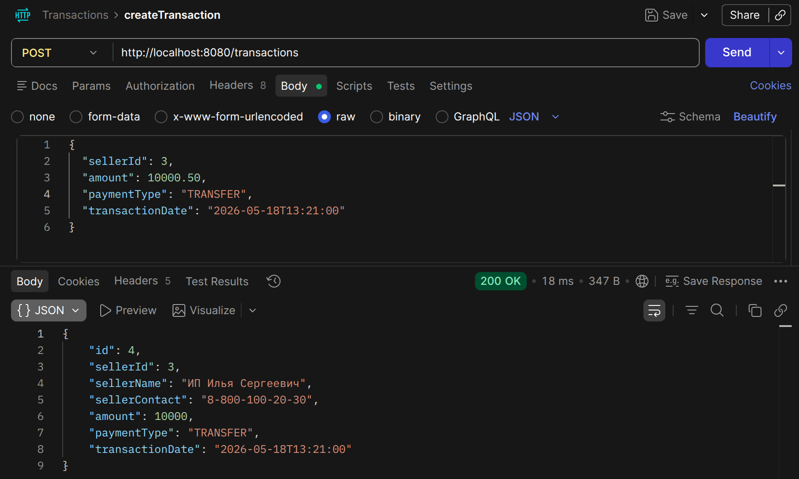

**Analytics**

**`GET /analytics/most-productive/{option}`**
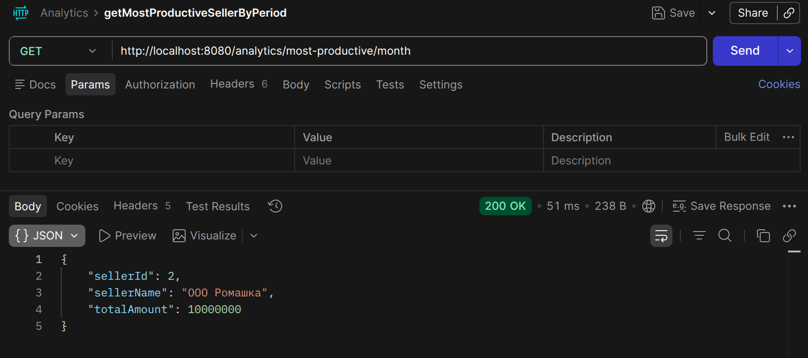

**`GET /analytics/less-than?from=yyyy-mm-ddThh:mm:ss&to=yyyy-mm-ddThh:mm:ss&amount=AMOUNT_NUM`**
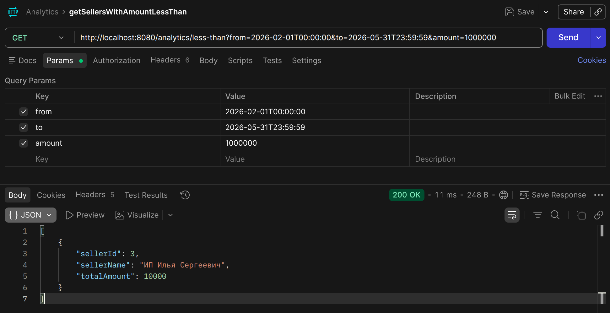

**`GET /analytics/best-period/{Seller id}`**
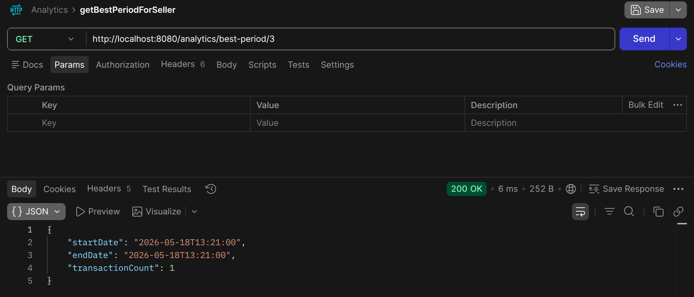